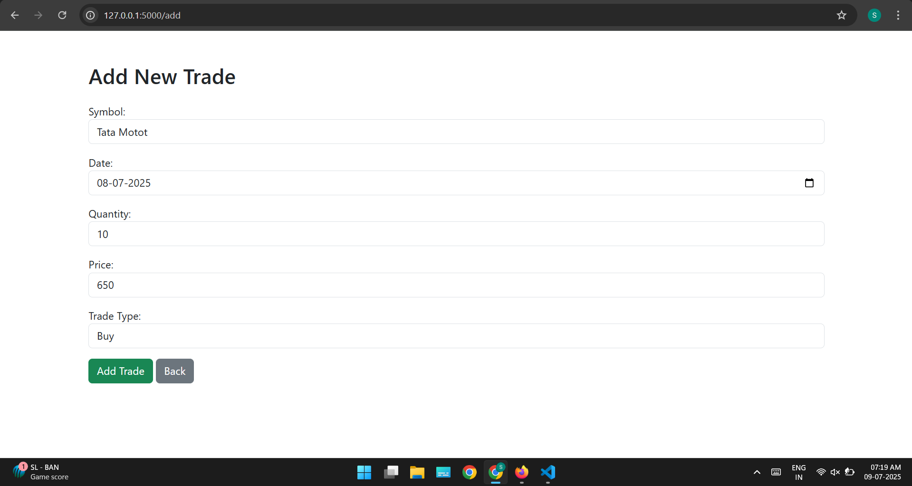
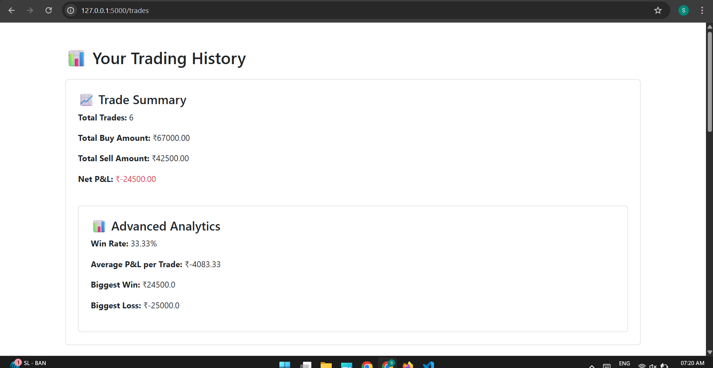
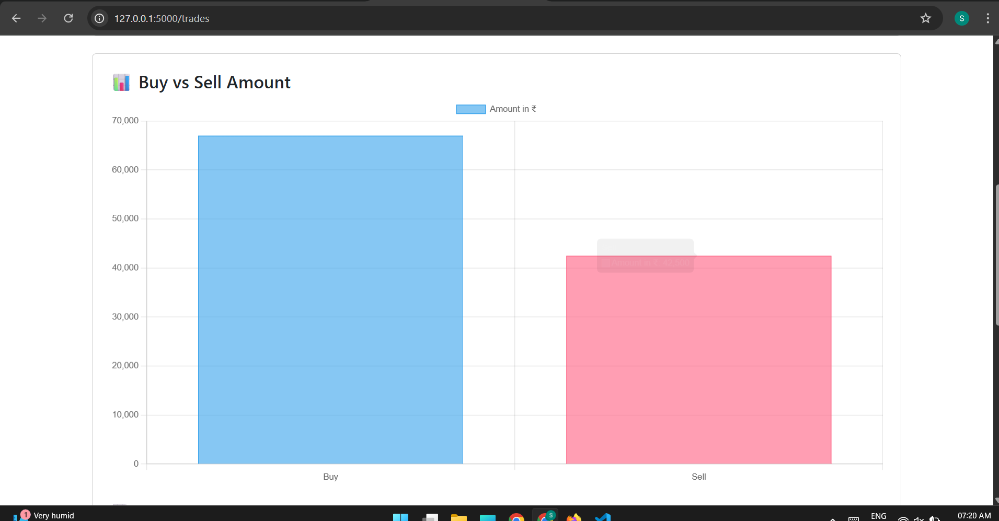
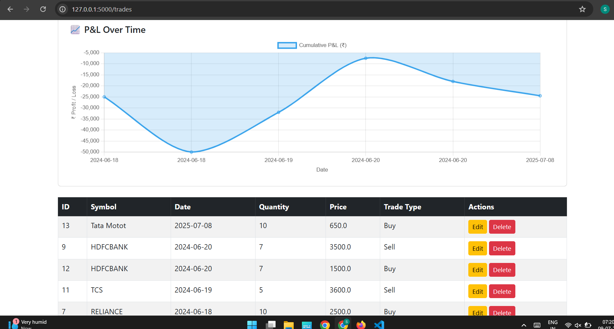
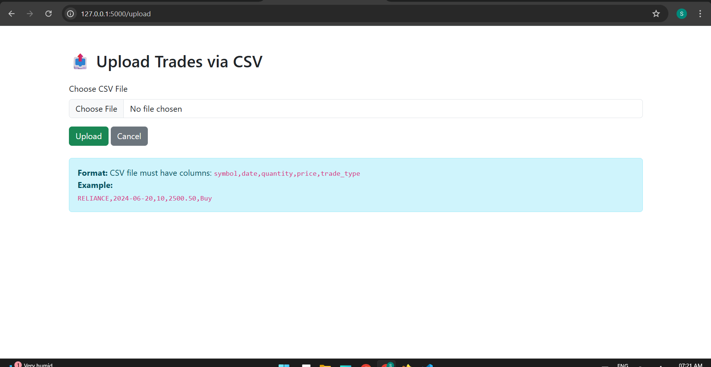

# 📊 Automated Trading Journal Web App

A simple yet powerful web application to help traders track, analyze, and improve their stock trading performance.

---

## ✅ Tech Stack

- **Backend**: Python + Flask  
- **Frontend**: HTML, Bootstrap, Chart.js  
- **Database**: SQLite  
- **Others**: CSV Upload Support, Jinja2 Templates

---

## 💡 Project Overview

This web app allows traders to:

- Log, edit, and delete their stock trades  
- Upload trade data via CSV  
- View trade summaries and P&L charts  
- Analyze performance with auto-calculated analytics

---

## 🛠️ Key Features

### 1. Add Trade Form
- Input: stock symbol, date, quantity, price, and trade type (Buy/Sell)
- Saves data into a local SQLite database

### 2. Trade Table View
- Displays all trades in a table format  
- Includes Edit/Delete options  
- Sorted by most recent trades

### 3. Upload CSV
- Bulk upload trades using `.csv` files  
- Validates data before inserting into the database

---

## 📷 Screenshots

| Trade Table | Add Trade | Upload CSV |
|-------------|-----------|-------------|
|  |  |  |

| Edit Trade | Chart View | Summary |
|------------|------------|---------|
|  |  |  |

---

## 🧪 How to Run Locally

```bash
# Clone the repo
git clone https://github.com/yourusername/trading-journal.git
cd trading-journal

# Create virtual environment
python -m venv venv
source venv/bin/activate  # or venv\Scripts\activate on Windows

# Install dependencies
pip install -r requirements.txt

# Run the app
python app.py


TRADING_JOURNAL/
├── templates/
│   ├── add_trade.html
│   ├── edit_trade.html
│   ├── index.html
│   ├── trades.html
│   └── upload.html
├── app.py
├── README.md
├── trades.db
├── .gitignore
├── venv/


⚙️ Future Improvements
Add user authentication

Add filtering/sorting by stock symbol or P&L

Deploy on Heroku or Render

👨‍💻 Author
Shreeyash Shamgonda Paraj


```bash
git add .
git commit -m "Updated README with screenshots and project details"
git push


ScreeShots of project:


